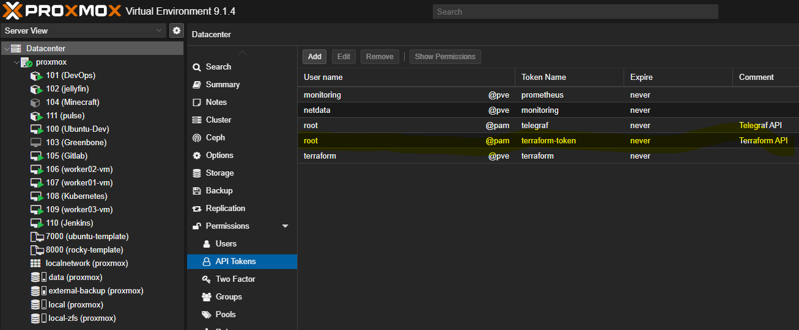
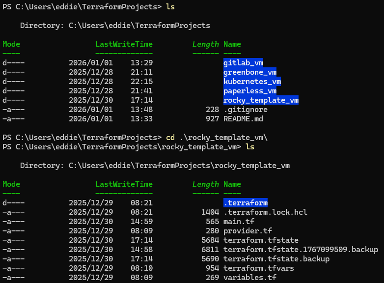
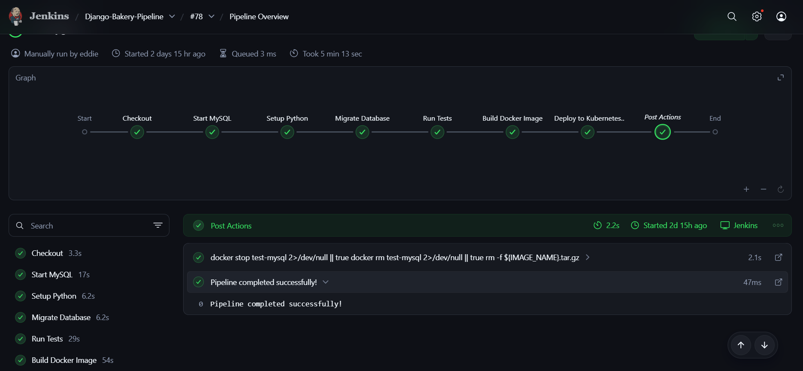
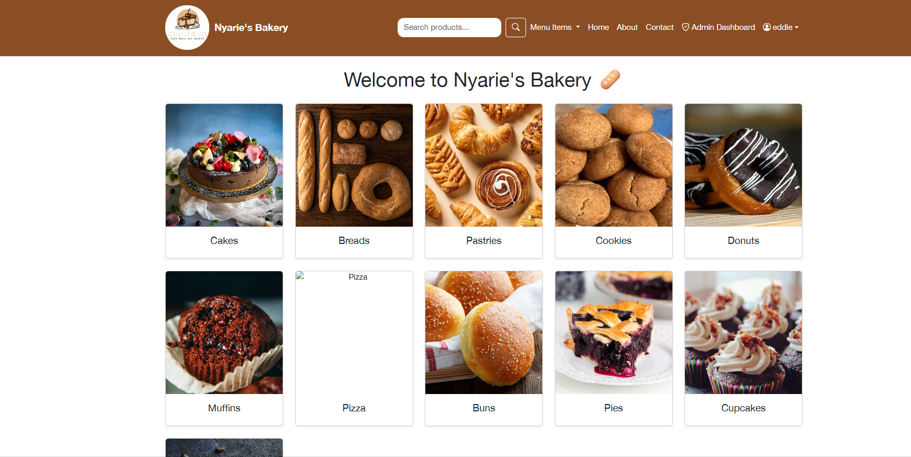
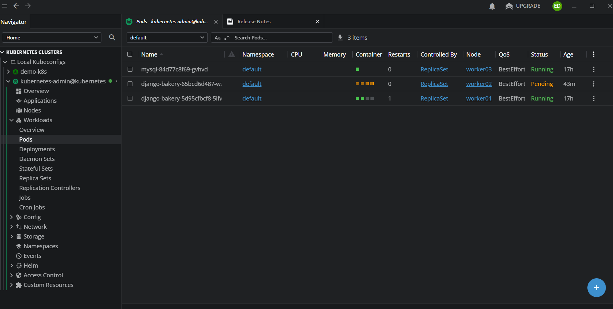
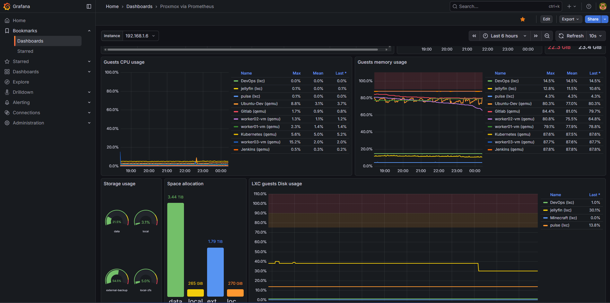
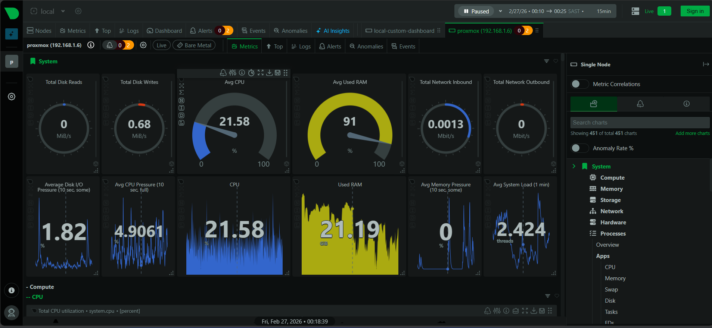
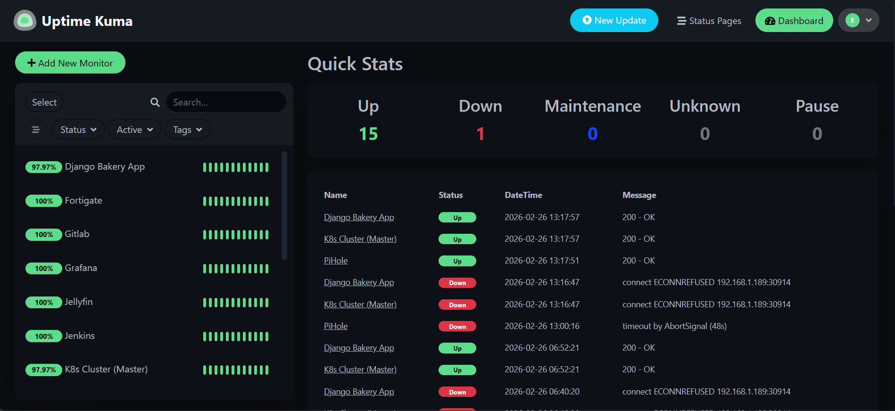
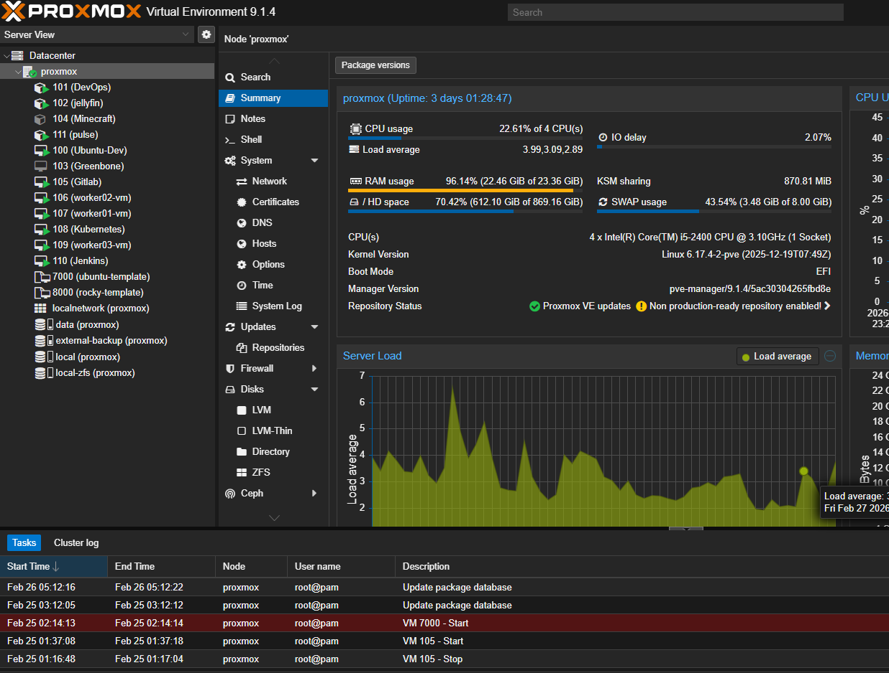
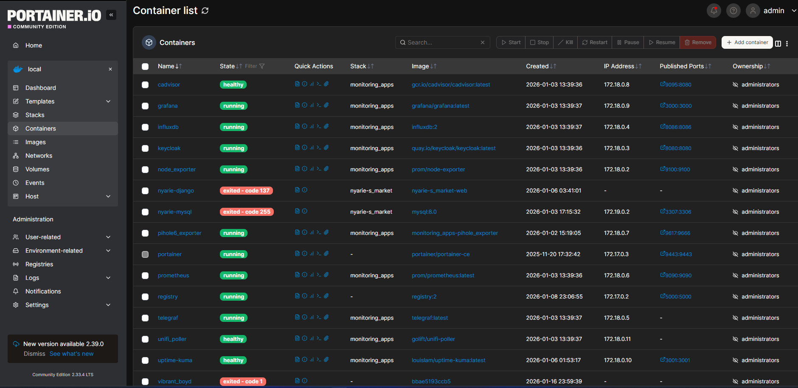

**Django Bakery App**

DevOps Pipeline - Full Documentation

*Terraform · Proxmox · Ansible · Jenkins · GitLab · Kubernetes*

## **Executive Summary**

This is a home-lab CI/CD pipeline I built from scratch to automate
deployments of a Django app using industry-standard tools. The goal was
to gain hands-on experience with IaC, container orchestration, and
GitOps workflows.

# 

## **Pipeline Overview**

This document describes the complete DevOps pipeline for the Django
Bakery application, from infrastructure provisioning to production
deployment on Kubernetes. The pipeline automates every stage: VM
creation, OS hardening, CI testing, container builds, and rolling
Kubernetes deployments.

## **Pipeline Stages**

  --------------------------------------------------------------------------
  **Stage**         **Tool**       **Description**
  ----------------- -------------- -----------------------------------------
  **1.              Terraform      Deploy all VMs onto Proxmox by cloning
  Provisioning**                   the Rocky Linux golden template

  **2. OS           Ansible        Harden SSH, install common tools,
  Configuration**                  configure cloud-init on all VMs

  **3. App          PyCharm +      Write Django code; use MySQL Workbench
  Development**     Workbench      for DB design; push to GitLab

  **4. CI --- Build Jenkins        Webhook trigger; spin up ephemeral MySQL;
  & Test**                         run migrations & unit tests; export
                                   Docker image

  **5. Image        Ansible        Copy Docker .tar + K8s configs from
  Delivery**                       Jenkins to Ansible LXC; distribute to K8s
                                   master

  **6. CD ---       Kubernetes     Spin up MySQL on worker-3; deploy
  Deploy**                         Django + Gunicorn + Nginx; rolling update
                                   per commit

  **7.              Prometheus +   node-exporter + kube-state-metrics →
  Observability**   Grafana        Prometheus :9090 → Grafana :3000
  --------------------------------------------------------------------------

## **VM Inventory**

  ----------------------------------- -----------------------------------
  **VM / LXC**                        IP Address

  **DevOps (Ansible LXC)**            192.168.1.6 (pct 101)

  **GitLab**                          192.168.1.158

  **Jenkins**                         192.168.1.192

  **Docker Registry / Prometheus /    192.168.1.10
  Grafana**                           

  **Kubernetes Master**               192.168.1.189

  **Kubernetes Worker 1**             192.168.1.179

  **Kubernetes Worker 2**             Dynamic (DHCP)

  **Kubernetes Worker 3 (MySQL)**     Dynamic (DHCP)
  ----------------------------------- -----------------------------------

**Rocky Linux 9 - Proxmox Template**

**VM ID: 8000 \| Host: 192.168.1.6**

**Goal: The final Proxmox template provides:**

-   Temporary user (eddie) with no password, SSH key-only access

-   DHCP networking

-   Fully updated system with common admin tools

-   cloud**-init ready - safe to clone multiple times**

**Template Specs (from qm config 8000)**

**Setting Value**

VM ID 8000

Name rocky-template

CPU 2 cores, x86-64-v2-AES

RAM 2048 MB

Disk 40GB (scsi0, qcow2, SSD emulation)

Network VirtIO, bridge vmbr0

Cloud-init ide2 (cdrom)

SCSI controller virtio-scsi-single

Template Yes

Storage data pool (qcow2 format)

**Phase 1 - Manual VM Creation**

**Step 1: Download the Rocky Linux 9 ISO**

-   **SSH into the Proxmox host first:** *ssh root@192.168.1.6*

-   **Then download the ISO:**

-   *cd /var/lib/vz/template/iso*

-   *wget
    https://download.rockylinux.org/pub/rocky/9/isos/x86_64/Rocky-9-latest-x86_64-minimal.iso*

**Step 2: Create the VM in Proxmox UI**

-   In the Proxmox web UI at https://192.168.1.6:8006, create a new VM
    with settings as above

**Step 3: Install Rocky Linux**

-   *Boot the VM and complete the installer with these settings:*

-   *Minimal install (no GUI)*

-   *Enable networking*

-   *Set root password*

-   *Create user: eddie*

-   *Enable SSH server*

**Once installation completes and the VM reboots, check the IP:**

-   *ip a*

-   Then SSH in from the Proxmox host to confirm access:

-   *ssh eddie@\<VM_IP\>*

-   Install the minimum prerequisites:

-   *sudo dnf install -y qemu-guest-agent cloud-init sudo*

-   *sudo systemctl enable qemu-guest-agent \--now*

-   *sudo systemctl enable cloud-init*

**Step 4: Set Up Passwordless Sudo for eddie**

-   *While logged in as eddie on the template VM:*

-   *echo \"eddie ALL=(ALL) NOPASSWD: ALL\" \| sudo tee
    /etc/sudoers.d/eddie*

-   *sudo chmod 0440 /etc/sudoers.d/eddie*

-   *sudo whoami \# should return: root*

**Terraform - VM Provisioning on Windows laptop**

Terraform runs from the Windows laptop at
C:\\Users\\eddie\\TerraformProjects. Each VM has its own isolated
project folder with its own state file. Two VMs are provisioned via
Terraform for this pipeline GitLab and Kubernetes. Jenkins and the
Ansible LXC were set up manually and are covered in their own sections.

**Project Structure**

C:\\Users\\eddie\\TerraformProjects\\

├── gitlab_vm\\

│ ├── main.tf

│ ├── provider.tf

│ ├── variables.tf

│ ├── terraform.tfvars ← never committed (gitignored)

│ └── .gitignore

├── kubernetes_vm\\

│ ├── main.tf

│ ├── provider.tf

│ ├── variables.tf

│ ├── terraform.tfvars ← never committed (gitignored)

│ └── .gitignore

└── .gitignore ← root-level gitignore covers all projects

**Prerequisites**

**1. Install Terraform**

-   Download from https://developer.hashicorp.com/terraform/install,
    extract the .zip, place terraform.exe in a folder (e.g.
    C:\\tools\\terraform\\) and add that folder to your Windows PATH
    environment variable.

**Verify the install:**

-   *PS C:\\Users\\eddie\> terraform \--version*

-   ***Terraform v1.9.x on windows_amd64***

**2. Install VS Code + HashiCorp Terraform Extension**

-   The Terraform extension gives syntax highlighting and autocomplete
    for .tf files. Search for HashiCorp Terraform in the VS Code
    extensions marketplace and install it.

**3. Create Proxmox API Token**

-   Terraform authenticates to Proxmox using an API token it does not
    use your root password.

-   In the Proxmox web UI at https://192.168.1.6:8006:

-   Go to Datacenter → Permissions → API Tokens

-   Click Add \| User: terraform@pve

-   Token ID: terraform

-   Uncheck \"Privilege Separation\"

-   Copy the token secret - it only displays once

-   Then assign permissions: Go to Datacenter → Permissions → Add → API
    Token Permission Path: /

-   Token: terraform@pve!terraform \| Role: PVEVMAdmin

Shared Files (same across both VM projects)

-   **provider.tf - tells Terraform which Proxmox provider to use and
    how to connect:**

*hclterraform {*

*required_providers {*

*proxmox = {*

*source = \"bpg/proxmox\"*

*version = \"0.69.0\"*

*}*

*}*

*}*

*provider \"proxmox\" {*

*endpoint = \"https://192.168.1.6:8006/\"*

*api_token = \"terraform@pve!terraform=\${var.pm_api_token_secret}\"*

*insecure = true*

*}*

**insecure = true disables SSL certificate verification. This is
acceptable for a home lab with a self-signed certificate. Do not use in
production.**

-   **variables.tf - declares the variables used across the config:**

*hclvariable \"pm_api_token_secret\" {*

*type = string*

*sensitive = true*

*}*

*variable \"ssh_public_key\" {*

*type = string*

*}*

*variable \"ssh_password_hash\" {*

*description = \"SHA-512 hashed password for user eddie\"*

*type = string*

*sensitive = true*

*}*

*terraform.tfvars --- supplies the actual secret values. This file is
gitignored and never committed:*

*hclpm_api_token_secret = \"\<your-proxmox-api-token-secret\>\"*

*ssh_public_key = \"\<your-ssh-public-key\>\"*

*ssh_password_hash = \"\<your-sha512-password-hash\>\"*

-   **To generate a SHA-512 password hash on Linux run:**

*openssl passwd -6 \"yourpassword*\"

-   \`.gitignore\` - prevents secrets and local state from being
    committed:

*.terraform/*

*\*.tfstate*

*\*.tfstate.backup*

*\*.tfvars*

*\*.tfplan*

*.terraform.lock.hcl*

*crash.log*

*\*.log*

-   **GitLab VM (gitlab_vm/main.tf)**

*hclresource \"proxmox_virtual_environment_vm\" \"gitlab\" {*

*name = \"Gitlab\"*

*node_name = \"proxmox\"*

*clone {*

*vm_id = 8000 \# Rocky Linux 9 template*

*full = true*

*}*

*cpu {*

*cores = 4*

*}*

*memory {*

*dedicated = 8192*

*}*

*disk {*

*interface = \"scsi0\"*

*datastore_id = \"local-zfs\"*

*size = 100*

*ssd = true*

*}*

*network_device {*

*bridge = \"vmbr0\"*

*model = \"virtio\"*

*}*

*agent {*

*enabled = true*

*}*

*initialization {*

*datastore_id = \"local-zfs\"*

*user_account {*

*username = \"eddie\"*

*keys = \[var.ssh_public_key\]*

*password = var.ssh_password_hash*

*}*

*ip_config {*

*ipv4 {*

*address = \"dhcp\"*

*}*

*}*

*}*

*started = true*

*on_boot = true*

*}*

-   **Kubernetes VM (kubernetes_vm/main.tf)**

*hclresource \"proxmox_virtual_environment_vm\" \"k8s\" {*

*name = \"Kubernetes\"*

*node_name = \"proxmox\"*

*clone {*

*vm_id = 8000 \# Rocky Linux 9 template*

*full = true*

*}*

*cpu {*

*cores = 2*

*}*

*memory {*

*dedicated = 2048*

*}*

*disk {*

*interface = \"scsi0\"*

*datastore_id = \"local-zfs\"*

*size = 100*

*ssd = true*

*}*

*network_device {*

*bridge = \"vmbr0\"*

*model = \"virtio\"*

*}*

*agent {*

*enabled = true*

*}*

*initialization {*

*datastore_id = \"local-zfs\"*

*user_account {*

*username = \"eddie\"*

*keys = \[var.ssh_public_key\]*

*password = var.ssh_password_hash*

*}*

*ip_config {*

*ipv4 {*

*address = \"dhcp\"*

*}*

*}*

*}*

*started = true*

*on_boot = true*

*}*

**Running Terraform -** Run these commands inside each VM\'s project
folder:

-   cd C:\\Users\\eddie\\TerraformProjects\\gitlab_vm

-   \# Download the Proxmox provider plugin (first time only)

-   terraform init

-   \# Preview what will be created

-   terraform plan

-   \# Create the VM

-   terraform apply

-   Type yes when prompted to confirm. Repeat for kubernetes_vm.

-   After both VMs are created, check the Proxmox UI to confirm they are
    running and note down the DHCP IP addresses assigned - you will need
    these for the Ansible inventory in the next stage.

-   Useful state commands:

-   powershellterraform state list \# list managed resources

-   terraform state rm proxmox_virtual_environment_vm.gitlab \# remove
    from state without destroying

⚠️ Once a VM is running and in use, do not re-run terraform apply
without careful review. Terraform may attempt to recreate or modify the
VM depending on what changed in the config.

**Stage 3 - Ansible LXC (Control Node)**

**Overview**

-   The Ansible LXC (CT 101, hostname DevOps) is the central control
    node for all configuration management and deployment orchestration
    in this pipeline. It runs on the Proxmox host at 192.168.1.182 and
    serves two distinct roles.

-   First, it manages all infrastructure configuration - running Ansible
    playbooks against GitLab, Jenkins, and the Kubernetes cluster.

-   Second, it acts as the deployment intermediary in the CD pipeline -
    Jenkins SCPs Docker image tarballs to this container, which then
    distributes them to Kubernetes nodes and triggers the rollout via
    Ansible.

**LXC Specifications**

**Setting Value**

CT ID 101

Hostname DevOps

OS Ubuntu 25.04 (Plucky Puffin)

IP Address 192.168.1.182

CPU 4 cores

RAM 4096 MB

Swap 512 MB

Disk 200 GB (data pool)

Unprivileged Yes

Nesting Enabled

Start at boot Yes

**Creating the LXC in Proxmox UI**

-   Log into the Proxmox web UI at https://192.168.1.6:8006

-   Click Create CT

-   Configure with the settings from the table above

-   Under Network set bridge to vmbr0 and IP to DHCP

-   After creation, go to the container Options tab and set:

-   Start at boot → Yes

-   Features → nesting → enabled

-   Start the container

-   Accessing the Container

-   From the Proxmox host shell:

-   *pct enter 101*

-   From any machine with SSH access:

-   *ssh root@192.168.1.182*

**Software Installation**

-   After starting the container, install the required packages:

-   *apt update && apt upgrade -y*

-   *apt install -y ansible git python3 python3-pip*

Versions confirmed in this environment:

-   Ansible core 2.18.1

-   Python 3.13.3

-   Git 2.48.1

**Project Structure**

-   All Ansible work lives under
    *\`/ecns_projects/ansible-devops-infra/\`:*

/ecns_projects/ansible-devops-infra/

├── ansible.cfg

├── site.yml

├── inventory/

│ └── lab/

│ ├── all_hosts.ini

│ ├── gitlab.ini

│ ├── jenkins.ini

│ ├── kubernetes.ini

│ └── rocky-template.ini

├── playbooks/

│ ├── gitlab.yml

│ ├── jenkins.yml

│ ├── kubernetes.yml

│ ├── deploy_app.yml

│ ├── deploy_mysql.yml

│ ├── deploy_full_stack.yml

│ ├── configure_django.yml

│ ├── rocky-template.yml

│ └── ubuntu-template.yml

├── roles/

│ ├── cleanup/

│ ├── cloudinit/

│ ├── common/

│ ├── docker/

│ ├── jenkins/

│ ├── kube-master/

│ ├── kube-node/

│ ├── ssh/

│ ├── updates/

│ ├── users/

│ └── validate/

└── templates/

**Ansible Configuration:
*/ecns_projects/ansible-devops-infra/ansible.cfg:***

*ini\[defaults\]*

*inventory = inventory/lab/all_hosts.ini*

*roles_path = roles*

*host_key_checking = False*

*retry_files_enabled = False*

**Inventory Structure:** The inventory is split by service. Each service
has its own .ini file under inventory/lab/ allowing playbooks to be run
against individual components without affecting others.

all_hosts.ini - used for broad operations across all hosts:

*ini\[gitlab\]*

*192.168.1.158 ansible_user=eddie*

*\[jenkins\]*

*192.168.1.192 ansible_user=root*

*\[kube_master\]*

*192.168.1.189 ansible_user=root*

*\[kube_node\]*

*192.168.1.171 ansible_user=root*

*192.168.1.179 ansible_user=root*

*192.168.1.188 ansible_user=root*

*\[all:children\]*

*gitlab*

*jenkins*

*kube_master*

*kube_node*

Per-service inventory files are used when running individual playbooks
and include additional connection details. For example gitlab.ini:

*ini\[gitlab\]*

*gitlab-vm ansible_host=192.168.1.158 ansible_user=eddie
ansible_become=true ansible_become_method=sudo*

*And kubernetes.ini:*

*ini\[kube_master\]*

*master-vm ansible_host=192.168.1.189*

*\[kube_workers\]*

*worker01-vm ansible_host=192.168.1.171*

*worker02-vm ansible_host=192.168.1.188*

*worker03-vm ansible_host=192.168.1.179*

*\[all:children\]*

*kube_master*

*kube_workers*

*\[all:vars\]*

*ansible_user=root*

*ansible_become=true*

*ansible_python_interpreter=/usr/bin/python3*

**SSH Key Setup:** Ansible connects to all managed hosts using an RSA
key generated on the DevOps LXC. Generate the key (done once):

-   *ssh-keygen -t rsa -b 4096 -C \"root@DevOps\" -f \~/.ssh/id_rsa -N
    \"\"*

Manually copy the public key to each managed host:

-   *ssh-copy-id -i \~/.ssh/id_rsa.pub eddie@192.168.1.158 \# GitLab*

-   *ssh-copy-id -i \~/.ssh/id_rsa.pub root@192.168.1.192 \# Jenkins*

-   *ssh-copy-id -i \~/.ssh/id_rsa.pub root@192.168.1.189 \# K8s master*

-   *ssh-copy-id -i \~/.ssh/id_rsa.pub root@192.168.1.171 \# worker01*

-   *ssh-copy-id -i \~/.ssh/id_rsa.pub root@192.168.1.188 \# worker02*

-   *ssh-copy-id -i \~/.ssh/id_rsa.pub root@192.168.1.179 \# worker03*

**Verify all hosts respond:**

-   cd /ecns_projects/ansible-devops-infra

-   ansible all -m ping

**Inbound SSH - Jenkins access to DevOps LXC :** The Jenkins server also
needs SSH access INTO this LXC to SCP Docker image tarballs and trigger
Ansible playbooks. The Jenkins public key must be added to the DevOps
LXC\'s authorized_keys:

-   *\# Run on the DevOps LXC*

-   *\# Paste the public key from the Jenkins server (\~/.ssh/id_rsa.pub
    on 192.168.1.192)*

-   *echo \"ssh-rsa \<jenkins-public-key\> jenkins@ci\" \>\>
    /root/.ssh/authorized_keys*

-   *chmod 600 /root/.ssh/authorized_keys*

-   To get the Jenkins public key:

-   *\# Run on Jenkins VM*

-   *cat \~/.ssh/id_rsa.pub*

**Stage 4 - GitLab VM**

The GitLab VM hosts the self-managed source control for this pipeline.
It was provisioned by Terraform from the Ubuntu template (VM ID 7000)
and configured via Ansible. It receives code pushes from PyCharm on the
development machine, stores the Django Bakery application in the
django-bakery-app repository, and triggers Jenkins via webhook on every
push to the django-app branch.

Setting Value

IP Address 192.168.1.158

OS Ubuntu 24.04.3 LTS (Noble Numbat)

GitLab Edition GitLab CE 18.7.0

Terraform Template VM ID 7000 (ubuntu-template)

Access <http://192.168.1.158>

ansible_user eddie (sudo)

**Step 1 - Terraform Provisioning**

The GitLab VM is provisioned from the Ubuntu template (VM ID 7000). The
main.tf for this VM lives at
C:\\Users\\eddie\\TerraformProjects\\gitlab_vm\\main.tf on the Windows
laptop.

From the Windows laptop:

-   cd C:\\Users\\eddie\\TerraformProjects\\gitlab_vm

-   terraform init

-   terraform plan

-   terraform apply

After provisioning, note the DHCP-assigned IP from the Proxmox UI - this
becomes 192.168.1.158. Update inventory/lab/gitlab.ini on the DevOps LXC
with this IP before running the Ansible playbook.

**Step 2 - Ansible Installation**

GitLab CE is installed using the gitlab.yml playbook from the DevOps
LXC. The playbook uses apt and targets Ubuntu. It installs dependencies,
adds the GitLab CE repository, installs the package, and runs gitlab-ctl
reconfigure.

Run from the DevOps LXC:

-   cd /ecns_projects/ansible-devops-infra

-   ansible-playbook playbooks/gitlab.yml -i inventory/lab/gitlab.ini

The playbook completes successfully in a single run. GitLab
reconfiguration takes several minutes - this is normal.

playbooks/gitlab.yml:

*yaml\-\--*

*- name: Install and configure GitLab*

*hosts: gitlab*

*become: true*

*vars:*

*gitlab_edition: gitlab-ce*

*tasks:*

*- name: Update apt cache*

*apt:*

*update_cache: yes*

*cache_valid_time: 3600*

*- name: Install required packages*

*apt:*

*name:*

*- curl*

*- openssh-server*

*- ca-certificates*

*- tzdata*

*- perl*

*- postfix*

*- gnupg*

*state: present*

*- name: Add GitLab repository GPG key*

*apt_key:*

*url: https://packages.gitlab.com/gitlab/gitlab-ce/gpgkey*

*state: present*

*- name: Add GitLab repository*

*apt_repository:*

*repo: \"deb https://packages.gitlab.com/gitlab/gitlab-ce/ubuntu/ {{
ansible_distribution_release }} main\"*

*state: present*

*filename: gitlab_gitlab-ce*

*- name: Install GitLab*

*apt:*

*name: \"{{ gitlab_edition }}\"*

*state: latest*

*update_cache: yes*

*- name: Reconfigure GitLab*

*command: gitlab-ctl reconfigure*

*args:*

*creates: /etc/gitlab/gitlab.rb*

**Step 3 - Initial Admin Setup**

After the playbook completes, retrieve the initial root password:

*sudo cat /etc/gitlab/initial_root_password*

Browse to http://192.168.1.158 and log in as root. The initial password
is only valid for 24 hours.

Complete the following:

-   Change the root password under User Settings → Password

-   Create user eddie --- Admin → Users → New User

-   Set eddie as an Administrator

-   Log in as eddie and set a permanent password

**Step 4 - external_url Note:** The external_url in
/etc/gitlab/gitlab.rb remains set to the default
http://gitlab.example.com. This was not changed because a domain was not
available and all Git operations use SSH over IP which works without a
correct external_url.

⚠️ If you need HTTPS, web-based clone URLs, or GitLab Pages to work
correctly in a rebuild, update this value before running gitlab-ctl
reconfigure:

-   sudo nano /etc/gitlab/gitlab.rb

-   \# Change: external_url \'http://gitlab.example.com\'

-   \# To: external_url \'http://192.168.1.158\'

-   sudo gitlab-ctl reconfigure

For this lab environment the default is left as-is.

**Step 5 - Create Repository**

Log in as eddie at http://192.168.1.158 and create a new project:

-   Project name: django-bakery-app

-   Visibility: Private

-   Initialize with README: Yes

The full project path becomes eddie/django-bakery-app.

**Step 6 - SSH Key Setup**

Jenkins clones the repository via SSH using the eddie@ubuntu-dev key.
This key must be registered in GitLab under the eddie user.

In GitLab, go to User Settings → SSH Keys → Add new key and paste the
Jenkins public key:

*sh# Get the public key from the Jenkins VM*

*ssh-keygen -y -f /root/.ssh/id_ed25519*

Paste the output into GitLab. Title it eddie@ubuntu-dev.

Also register the Proxmox/admin key if needed for root access:

Title: root@proxmox

Verify SSH access from Jenkins:

*\# Run on Jenkins VM*

*ssh -T git@192.168.1.158*

*\# Expected: Welcome to GitLab, \@eddie!*

**Step 7 - Allow Local Network Webhook Requests**

By default GitLab blocks webhooks to local/private IP ranges. Since
Jenkins is on the same LAN, this must be enabled.

Log in as root and go to Admin → Settings → Network → Outbound requests:

-   Enable: Allow requests to the local network from webhooks and
    integrations

-   Add to allowlist: 192.168.1.192

-   Save changes

**Step 8 - Jenkins Webhook Configuration**

In the django-bakery-app project go to Settings → Webhooks → Add new
webhook:

Field Value

URL <http://192.168.1.192:8080/project/Django-Bakery-Pipeline>

Trigger Push events

Trigger Merge request events

SSL verification Disabled

Click Add webhook. Then click Test → Push events to confirm Jenkins
receives the trigger and responds with HTTP 200.

**Step 9 - Push Application Code**

Clone the repository on the development machine and push the Django
Bakery app to the django-app branch:

bashgit clone git@192.168.1.158:eddie/django-bakery-app.git

cd django-bakery-app

git checkout -b django-app

\# Add application files

git add .

git commit -m \"Initial Django Bakery application\"

git push origin django-app

This push triggers the Jenkins webhook and starts the first pipeline
run.

Verification

Confirm all GitLab services are running:

*sudo gitlab-ctl status*

All services should show \`run:\` status including \`puma\`,
\`sidekiq\`, \`postgresql\`, \`redis\`, \`nginx\`, and \`gitaly\`.

Confirmed running services in this environment:

*run: alertmanager, gitaly, gitlab-exporter, gitlab-kas*

*run: gitlab-workhorse, nginx, node-exporter, postgresql*

*run: puma, redis, sidekiq*

**Stage 5 -- Jenkins:**

Jenkins is the CI/CD engine for this pipeline. It runs on a dedicated
Rocky Linux 9 VM provisioned by Terraform, configured initially via
Ansible, then completed with manual post-install steps. It receives
webhook triggers from GitLab, runs tests against an ephemeral MySQL
container, builds a Docker image, and hands off to the Ansible DevOps
LXC for Kubernetes deployment.

Setting Value

IP Address 192.168.1.192

OS Rocky Linux 9

Jenkins Version 2.528.3 LTS

Java OpenJDK 17.0.17

Python 3.11.8 (compiled from source)

Docker 29.1.5 CE

Access http://192.168.1.192:8080

**Step 1 - Ansible Installation** - Jenkins is provisioned using the
Ansible jenkins role from the DevOps LXC. The role handles Jenkins
repository setup, GPG key import, installation, and service startup.

**Run from the DevOps LXC:**

-   *cd /ecns_projects/ansible-devops-infra*

-   *ansible-playbook playbooks/jenkins.yml -i
    inventory/lab/jenkins.ini*

The role installs Java 11 as a baseline and starts Jenkins on port 8080.
After the playbook completes, retrieve the initial admin password
printed in the Ansible output, then complete the Jenkins setup wizard at
http://192.168.1.192:8080.

During the setup wizard install the following plugins:

-   Git

-   Pipeline

-   Docker Pipeline

-   SSH Agent

-   GitLab

Step 2 - Upgrade Java to 17

Jenkins 2.528.3 LTS requires Java 17. After the Ansible role installs
Java 11, upgrade manually on the Jenkins VM:

-   *dnf install -y java-17-openjdk java-17-openjdk-headless*

Then configure Jenkins to use Java 17 by creating a systemd drop-in:

-   *bashmkdir -p /etc/systemd/system/jenkins.service.d/*

-   *cat \> /etc/systemd/system/jenkins.service.d/java.conf \<\<
    \'EOF\'*

-   *\[Service\]*

-   *Environment=\"JAVA_HOME=/usr/lib/jvm/java-17-openjdk\"*

-   *Environment=\"PATH=/usr/lib/jvm/java-17-openjdk/bin:/usr/bin:/bin\"*

-   *EOF*

-   *systemctl daemon-reload*

-   *systemctl restart jenkins*

Verify:

-   java -version

-   \# openjdk version \"17.0.17\"

Step 3 - Install Docker CE

Docker is installed from the official Docker repository, not from
Rocky\'s default repos:

-   *dnf install -y yum-utils*

-   *yum-config-manager \--add-repo
    https://download.docker.com/linux/rhel/docker-ce.repo*

-   *dnf install -y docker-ce docker-ce-cli containerd.io
    docker-buildx-plugin docker-compose-plugin*

-   *systemctl enable docker \--now*

Add the jenkins user to the docker group so Jenkins can run Docker
commands without sudo:

-   *usermod -aG docker jenkins*

-   *systemctl restart jenkins*

Verify:

-   *docker \--version*

-   *\# Docker version 29.1.5*

-   *groups jenkins*

-   *\# jenkins docker*

Step 4 - Install Python 3.11 from Source: Python 3.11 is not available
in Rocky Linux 9 standard repositories and must be compiled from source.
This is required for the Django test pipeline.

Install build dependencies first:

-   *dnf install -y gcc gcc-c++ make*

-   *dnf install -y libffi-devel bzip2 bzip2-devel xz-devel zlib-devel
    sqlite-devel*

Download and compile Python 3.11.8:

-   *cd /usr/src*

-   *wget https://www.python.org/ftp/python/3.11.8/Python-3.11.8.tgz*

-   *tar xzf Python-3.11.8.tgz*

-   *cd Python-3.11.8*

-   *./configure \--enable-optimizations*

-   *make altinstall*

⚠️ Use make altinstall not make install - this prevents overwriting the
system default python3 binary.

Add Python 3.11 to PATH permanently:

-   *echo \'export PATH=/usr/local/bin:\$PATH\' \>
    /etc/profile.d/python311.sh*

-   *chmod +x /etc/profile.d/python311.sh*

-   *source /etc/profile.d/python311.sh*

Verify:

-   *python3.11 \--version*

-   *\# Python 3.11.8*

-   *which python3.11*

-   *\# /usr/local/bin/python3.11*

**Step 5 - Install mysqlclient Dependencies**: The Jenkins pipeline
installs mysqlclient via pip inside the Python venv. This requires
MariaDB development libraries on the Jenkins VM:

-   dnf install -y mariadb-devel

Without this, pip install mysqlclient will fail during the pipeline run
with a compiler error.

**Step 6 - SSH Key Setup:** Jenkins uses an ed25519 SSH key for two
purposes - cloning from GitLab and SCPing Docker tarballs to the DevOps
LXC. The key was generated on the development machine and the private
key copied to Jenkins.

The key must be present at /root/.ssh/id_ed25519 on the Jenkins VM.
Verify:

-   *ls \~/.ssh/*

-   *\# id_ed25519 authorized_keys known_hosts*

The DevOps LXC must also have the Jenkins public key in its
authorized_keys (covered in Stage 3). Verify Jenkins can reach the
DevOps LXC:

-   *ssh -o StrictHostKeyChecking=no root@192.168.1.182 \"hostname\"*

-   *\# DevOps*

And verify Jenkins can clone from GitLab:

-   *ssh -T git@192.168.1.158*

**Step 7 - Jenkins Credentials:**

Navigate to
http://192.168.1.192:8080/manage/credentials/store/system/domain/\_/ and
add the following credentials, all with Global scope:

  -----------------------------------------------------------------------
  **ID**                  **Type**                **Description**
  ----------------------- ----------------------- -----------------------
  git-ssh-key             SSH Username with       Private key from
                          private key             /root/.ssh/id_ed25519
                                                  for GitLab clone

  devops-ssh-key          SSH Username with       Same private key for
                          private key             SCP/SSH to DevOps LXC

  db-user                 Secret text             MySQL username for CI
                                                  test database

  db-password             Secret text             MySQL password for CI
                                                  test database
  -----------------------------------------------------------------------

For git-ssh-key and devops-ssh-key, paste the contents of
/root/.ssh/id_ed25519 directly into the Jenkins credential form.

Step 8 - GitLab Connection

Jenkins needs to accept webhook calls from GitLab. Configure the GitLab
connection under Manage Jenkins → System → GitLab:

-   Connection name: gitlab

-   GitLab host URL: http://192.168.1.158

-   Credentials: the gitlab-token API token from GitLab

Also configure Jenkins security to allow anonymous webhook triggers.
Navigate to Manage Jenkins → Security → Authorization and grant the
Anonymous user Job → Build permission.

⚠️ This is a lab-only configuration. In production, use a proper webhook
secret token instead.

Step 9 - Pipeline Job Configuration

Create a new Pipeline job named Django-Bakery-Pipeline:

-   Description: CI/CD pipeline for Django Bakery app

-   Discard old builds: keep 10 builds

-   Do not allow concurrent builds: enabled

-   Build Triggers: Build when a change is pushed to GitLab

    -   Enable: Push Events

    -   Enable: Opened Merge Request Events

    -   Enable: Build only if new commits were pushed

-   Pipeline Definition: Pipeline script

-   Paste the full Jenkinsfile below

**Step 10 - Jenkinsfile**

*groovypipeline {*

*agent any*

*options {*

*disableConcurrentBuilds()*

*buildDiscarder(logRotator(numToKeepStr: \'10\'))*

*}*

*environment {*

*DB_NAME = \'bake_db\'*

*DB_HOST = \'127.0.0.1\'*

*DB_PORT = \'3306\'*

*DB_USER = credentials(\'db-user\')*

*DB_PASSWORD = credentials(\'db-password\')*

*IMAGE_NAME = \'django-bakery-app\'*

*DEVOPS_HOST = \'192.168.1.182\'*

*}*

*stages {*

*stage(\'Checkout\') {*

*steps {*

*git branch: \'django-app\',*

*url: \'git@192.168.1.158:eddie/django-bakery-app.git\',*

*credentialsId: \'git-ssh-key\'*

*}*

*}*

*stage(\'Start MySQL\') {*

*steps {*

*sh \'\'\'*

*docker run -d \--name test-mysql \\*

*-e MYSQL_ROOT_PASSWORD=rootpass \\*

*-e MYSQL_DATABASE=\${DB_NAME} \\*

*-e MYSQL_USER=\${DB_USER} \\*

*-e MYSQL_PASSWORD=\${DB_PASSWORD} \\*

*-p \${DB_PORT}:3306 \\*

*mysql:8.0 \--default-authentication-plugin=mysql_native_password*

*echo \"Waiting for MySQL to be ready\...\"*

*until docker exec test-mysql mysqladmin ping -h127.0.0.1 \--silent; do*

*sleep 2*

*done*

*echo \"Creating user and granting privileges\...\"*

*docker exec test-mysql mysql -uroot -prootpass -e \"*

*CREATE USER IF NOT EXISTS \'\${DB_USER}\'@\'%\' IDENTIFIED BY
\'\${DB_PASSWORD}\';*

*GRANT ALL PRIVILEGES ON \*.\* TO \'\${DB_USER}\'@\'%\' WITH GRANT
OPTION;*

*FLUSH PRIVILEGES;\"*

*\'\'\'*

*}*

*}*

*stage(\'Setup Python\') {*

*steps {*

*sh \'\'\'*

*/usr/local/bin/python3.11 -m venv venv*

*. venv/bin/activate*

*python -m pip install \--upgrade pip*

*pip install \--no-cache-dir -r requirements.txt*

*\'\'\'*

*}*

*}*

*stage(\'Migrate Database\') {*

*steps {*

*sh \'. venv/bin/activate && python manage.py migrate\'*

*}*

*}*

*stage(\'Run Tests\') {*

*steps {*

*sh \'. venv/bin/activate && python manage.py test\'*

*}*

*}*

*stage(\'Build Docker Image\') {*

*steps {*

*script {*

*def gitCommit = sh(*

*returnStdout: true,*

*script: \'git rev-parse \--short HEAD\'*

*).trim()*

*env.IMAGE_TAG = gitCommit*

*def cacheBust = sh(*

*returnStdout: true,*

*script: \'date +%s\'*

*).trim()*

*sh \"\"\"*

*docker build \\*

*\--build-arg CACHEBUST=\${cacheBust} \\*

*-t \${IMAGE_NAME}:\${IMAGE_TAG} \\*

*-t \${IMAGE_NAME}:latest \\*

*.*

*docker save \${IMAGE_NAME}:\${IMAGE_TAG} \| gzip \>
\${IMAGE_NAME}.tar.gz*

*echo \"Compressed image size:\"*

*du -sh \${IMAGE_NAME}.tar.gz*

*\"\"\"*

*}*

*}*

*}*

*stage(\'Deploy to Kubernetes (Ansible)\') {*

*steps {*

*sshagent(\[\'devops-ssh-key\'\]) {*

*sh \"\"\"*

*scp -o StrictHostKeyChecking=no \${IMAGE_NAME}.tar.gz
root@\${DEVOPS_HOST}:/tmp/*

*ssh -o StrictHostKeyChecking=no root@\${DEVOPS_HOST} \'*

*gunzip -f /tmp/\${IMAGE_NAME}.tar.gz*

*sed -i \"s\|image: \${IMAGE_NAME}:.\*\|image:
\${IMAGE_NAME}:\${IMAGE_TAG}\|g\" \\*

*/ecns_projects/myapp/k8s/deployment.yaml*

*grep \"image:\" /ecns_projects/myapp/k8s/deployment.yaml*

*cd /ecns_projects/ansible-devops-infra &&*

*ansible-playbook playbooks/deploy_app.yml \\*

*-e image_name=\${IMAGE_NAME} \\*

*-e image_tag=\${IMAGE_TAG}*

*\'*

*\"\"\"*

*}*

*}*

*}*

*}*

*post {*

*always {*

*sh \'\'\'*

*docker stop test-mysql 2\>/dev/null \|\| true*

*docker rm test-mysql 2\>/dev/null \|\| true*

*rm -f \${IMAGE_NAME}.tar.gz*

*\'\'\'*

*}*

*success {*

*echo \'Pipeline completed successfully!\'*

*}*

*failure {*

*echo \'Pipeline failed. Check the logs above for details.\'*

*}*

*}*

*}*

**Stage 6 - Django Bakery Application**

The Django Bakery App is the sample e-commerce application used to
validate the full CI/CD pipeline. It is a full-stack Django 5.1 web
application with a REST API, Stripe payment integration, product
catalogue, and PDF report generation. It was developed in PyCharm on the
Windows laptop, uses MySQL as its database, and is version-controlled in
GitLab under eddie/django-bakery-app on the django-app branch.

**Application Structure**

django-bakery-app/

├── manage.py

├── requirements.txt

├── Dockerfile

├── .env ← local secrets (never committed)

├── bakery_app/ ← Django project config

│ ├── settings.py

│ ├── urls.py

│ ├── wsgi.py

│ ├── asgi.py

│ └── db_routers.py

├── web_app/ ← main Django application

│ ├── models.py

│ ├── views.py

│ ├── forms.py

│ ├── urls.py

│ ├── serializers.py

│ ├── admin.py

│ ├── tests.py

│ ├── decorators.py

│ ├── context_processors.py

│ ├── utils.py

│ ├── migrations/

│ │ ├── 0001_initial.py

│ │ └── 0002_category_image_customuser_cell.py

│ ├── management/commands/

│ │ ├── seed_db.py

│ │ ├── cleanup_users.py

│ │ └── assign_vendor_ids.py

│ ├── templates/

│ │ ├── admins/

│ │ └── vendor/

│ ├── static/

│ │ ├── css/

│ │ └── images/

│ └── templatetags/

│ └── math_extras.py

└── media/

└── products/ ← uploaded product images

├── breads, cakes, cookies, croissants

├── donuts, muffins, pastries, pies

└── \...

**Key Dependencies**

  -----------------------------------------------------------------------
  Package                     Purpose
  --------------------------- -------------------------------------------
  Django 5.1                  Web framework

  mysqlclient 2.2.4           MySQL database driver

  djangorestframework         REST API

  drf-yasg                    Swagger API documentation

  stripe 12.5.1               Payment processing

  gunicorn 23.0.0             WSGI server

  pillow                      Image handling

  reportlab                   PDF generation

  python-decouple             Environment variable management

  whitenoise                  Static file serving
  -----------------------------------------------------------------------

**Development Environment**

The app was developed using PyCharm Community Edition on a Windows
laptop. MySQL Workbench was used to connect to a local MySQL instance
during development to design and inspect the schema.

Local setup:

1.Clone the repository:

-   bash

-   git clone git@192.168.1.158:eddie/django-bakery-app.git

-   cd django-bakery-app

-   git checkout django-app

2.Create and activate virtual environment:

-   powershell

-   python -m venv .venv

-   .venv\\Scripts\\activate

-   pip install -r requirements.txt

3.Create .env file in the project root:

-   SECRET_KEY=your-django-secret-key

-   DEBUG=True

-   DB_NAME=bake_db

-   DB_USER=your_db_user

-   DB_PASSWORD=your_db_password

-   DB_HOST=localhost

-   DB_PORT=3306

-   STRIPE_SECRET_KEY=sk_test\_\...

-   STRIPE_PUBLISHABLE_KEY=pk_test\_\...

-   STRIPE_WEBHOOK_SECRET=whsec\_\...

4.Run migrations and start the development server:

-   python manage.py migrate

-   python manage.py runserver

**Environment Variables**

The app uses python-decouple to read all sensitive configuration from
environment variables or a .env file. The complete list of variables:

  ------------------------------------------------------------------------
  Variable                   Required   Description
  -------------------------- ---------- ----------------------------------
  SECRET_KEY                 Yes        Django secret key

  DEBUG                      No         Debug mode, default True

  DB_NAME                    No         Database name, default dummy

  DB_USER                    No         Database user, default dummy

  DB_PASSWORD                No         Database password, default dummy

  DB_HOST                    No         Database host, default localhost

  DB_PORT                    No         Database port, default 3306

  STRIPE_SECRET_KEY          No         Stripe secret key, default \"\"

  STRIPE_PUBLISHABLE_KEY     No         Stripe publishable key, default
                                        \"\"

  STRIPE_WEBHOOK_SECRET      No         Stripe webhook secret, default
                                        \"\"
  ------------------------------------------------------------------------

⚠️ During Docker builds, DJANGO_COLLECTSTATIC=1 is set which disables
database access entirely - this prevents connection errors when
collecting static files at build time.

**Dockerfile:** The Dockerfile builds a production-ready image based on
python:3.11-slim. Static files are collected at build time, not at
container startup.

*FROM python:3.11-slim*

*ENV PYTHONDONTWRITEBYTECODE=1*

*ENV PYTHONUNBUFFERED=1*

*RUN apt-get update && apt-get install -y \\*

*gcc \\*

*default-libmysqlclient-dev \\*

*pkg-config \\*

*curl \\*

*&& rm -rf /var/lib/apt/lists/\**

*WORKDIR /app*

*COPY requirements.txt .*

*RUN pip install \--upgrade pip && \\*

*pip install \--no-cache-dir -r requirements.txt*

*ARG CACHEBUST=1*

*COPY . .*

*ENV DJANGO_COLLECTSTATIC=1*

*RUN mkdir -p staticfiles && \\*

*python manage.py collectstatic \--noinput*

*EXPOSE 8000*

*HEALTHCHECK \--interval=30s \--timeout=5s \--start-period=20s \\*

*CMD curl -f http://localhost:8000/ \|\| exit 1*

*CMD \[\"gunicorn\", \"\--bind\", \"0.0.0.0:8000\", \"\--workers\",
\"3\", \"bakery_app.wsgi:application\"\]*

Key Dockerfile design decisions:

-   ARG CACHEBUST=1 - Jenkins passes a timestamp here to force a full
    rebuild on every pipeline run, bypassing Docker layer cache

-   DJANGO_COLLECTSTATIC=1 disables DATABASES in settings.py during the
    build so no MySQL connection is needed

-   Static files collected at build time and served by nginx in
    Kubernetes, not gunicorn

**Pushing to GitLab**

All development work is pushed to the django-app branch. The main branch
is kept clean for production-ready code.

-   *git add .*

-   *git commit -m \"your commit message\"*

-   *git push origin django-app*

Every push to django-app triggers the GitLab webhook which starts the
Jenkins pipeline automatically.

**First CI Run:** To trigger the first pipeline run after initial setup:

-   *git add web_app/tests.py*

-   *git commit -m \"Trigger first Jenkins pipeline run\"*

-   *git push origin django-app*

Watch the pipeline at
http://192.168.1.192:8080/job/Django-Bakery-Pipeline/.

A successful first run confirms:

-   GitLab webhook is working

-   Jenkins can clone via SSH

-   MySQL test container starts correctly

-   Django migrations run successfully

-   All unit tests pass

-   Docker image builds successfully

-   Image is transferred to DevOps LXC

-   Ansible deploys to Kubernetes

**Stage 7 - Kubernetes Cluster**

The Kubernetes cluster consists of 1 control-plane node and 3 worker
nodes, all running Rocky Linux 9.7 with containerd 2.2.1 as the
container runtime. The cluster was built manually - nodes were cloned
from the Rocky Linux template in Proxmox, prepared with the required
system configuration, and joined using kubeadm. Flannel is used as the
CNI. The cluster runs the Django Bakery app and MySQL as separate
workloads with deliberate node separation.

Cluster topology:

  -----------------------------------------------------------------------
  Node             Role             IP                Kernel
  ---------------- ---------------- ----------------- -------------------
  master-vm        control-plane    192.168.1.189     5.14.0-611.5.1

  worker01-vm      worker           192.168.1.171     5.14.0-611.16.1

  worker02-vm      worker           192.168.1.188     5.14.0-611.16.1

  worker03-vm      worker           192.168.1.179     5.14.0-611.5.1
  -----------------------------------------------------------------------

**Step 1 - Provision VMs from Rocky Template**

All nodes were cloned manually from the Rocky Linux template (VM ID
8000) in the Proxmox UI. For each node:

1.  Log into Proxmox at https://192.168.1.6:8006

2.  Right-click VM 8000 (rocky-template) → Clone

3.  Set the VM name (master-vm, worker01-vm, worker02-vm, worker03-vm)

4.  Select Full Clone

5.  Start the VM and note the DHCP IP

Set hostnames on each VM after first boot:

-   *\# On master*

-   *hostnamectl set-hostname master-vm*

-   *\# On each worker*

-   *hostnamectl set-hostname worker01-vm \# repeat for worker02,
    worker03*

**Step 2 - Distribute SSH Keys**

From the DevOps LXC, copy the Ansible SSH key to all nodes:

*ssh-copy-id -i \~/.ssh/id_rsa.pub root@192.168.1.189 \# master*

*ssh-copy-id -i \~/.ssh/id_rsa.pub root@192.168.1.171 \# worker01*

*ssh-copy-id -i \~/.ssh/id_rsa.pub root@192.168.1.188 \# worker02*

*ssh-copy-id -i \~/.ssh/id_rsa.pub root@192.168.1.179 \# worker03*

Verify connectivity:

*cd /ecns_projects/ansible-devops-infra*

*ansible -i inventory/lab/kubernetes.ini all -m ping*

**Step 3 - System Preparation (All Nodes)**

Run on every node - master and all three workers:

**Install common utilities via Ansible:**

*ansible-playbook playbooks/kubernetes.yml -i
inventory/lab/kubernetes.ini \--tags setup*

This runs the common role which installs utilities, enables chrony, and
starts qemu-guest-agent.

Then manually complete the Kubernetes prerequisites on each node:

*\# Update system*

*dnf update -y*

*dnf install -y yum-utils device-mapper-persistent-data lvm2*

*\# Load kernel modules*

*tee /etc/modules-load.d/k8s.conf \<\<EOF*

*overlay*

*br_netfilter*

*EOF*

*modprobe overlay*

*modprobe br_netfilter*

*\# Disable swap permanently*

*swapoff -a*

*sed -i \'/swap/d\' /etc/fstab*

*\# Configure sysctl for Kubernetes networking*

*tee /etc/sysctl.d/k8s.conf \<\<EOF*

*net.bridge.bridge-nf-call-ip6tables = 1*

*net.bridge.bridge-nf-call-iptables = 1*

*net.ipv4.ip_forward = 1*

*EOF*

*sysctl \--system*

*\# Set SELinux to permissive*

*setenforce 0*

*sed -i \'s/\^SELINUX=enforcing/SELINUX=permissive/\'
/etc/selinux/config*

*\# Configure firewall ports*

*firewall-cmd \--permanent \--add-port=6443/tcp*

*firewall-cmd \--permanent \--add-port=2379-2380/tcp*

*firewall-cmd \--permanent \--add-port=10250/tcp*

*firewall-cmd \--permanent \--add-port=30000-32767/tcp*

*firewall-cmd \--reload*

**Step 4 - Install containerd (All Nodes)**

*dnf config-manager \--add-repo
https://download.docker.com/linux/centos/docker-ce.repo*

*dnf makecache*

*dnf install -y containerd.io*

*mkdir -p /etc/containerd*

*containerd config default \> /etc/containerd/config.toml*

*sed -i \'s/SystemdCgroup = false/SystemdCgroup = true/\'
/etc/containerd/config.toml*

*systemctl enable \--now containerd*

⚠️ The SystemdCgroup = true change is critical. Without it kubelet and
containerd use different cgroup drivers and the cluster will not form
correctly.

**Step 5 - Install Kubernetes Components (All Nodes)**

*tee /etc/yum.repos.d/kubernetes.repo \<\<\'EOF\'*

*\[kubernetes\]*

*name=Kubernetes*

*baseurl=https://pkgs.k8s.io/core:/stable:/v1.29/rpm/*

*enabled=1*

*gpgcheck=1*

*gpgkey=https://pkgs.k8s.io/core:/stable:/v1.29/rpm/repodata/repomd.xml.key*

*EOF*

*dnf makecache*

*dnf install -y kubelet kubeadm kubectl*

*systemctl enable \--now kubelet*

⚠️ kubelet will show a crashloop until kubeadm init is run on the
master. This is expected.

**Step 6 - Initialize Control Plane (Master Only)**

*kubeadm init \--pod-network-cidr=10.244.0.0/16*

After completion, configure kubectl for root:

*mkdir -p \$HOME/.kube*

*cp -i /etc/kubernetes/admin.conf \$HOME/.kube/config*

*chown \$(id -u):\$(id -g) \$HOME/.kube/config*

Verify master will show NotReady until CNI is installed:

*kubectl get nodes*

**Step 7 - Install Flannel CNI (Master Only)**

*kubectl apply -f
https://raw.githubusercontent.com/flannel-io/flannel/master/Documentation/kube-flannel.yml*

Wait approximately 40 seconds then verify:

*kubectl get pods -n kube-flannel*

*kubectl get nodes*

*\# master-vm should now show Ready*

**Step 8 - Join Worker Nodes**

On the master, generate the join command:

*kubeadm token create \--print-join-command*

Copy the output and run it on each worker node:

*kubeadm join 192.168.1.189:6443 \\*

*\--token \<token\> \\*

*\--discovery-token-ca-cert-hash sha256:\<hash\>*

Verify from master:

*kubectl get nodes*

*\# All nodes should show Ready*

If a worker fails to join, reset and retry:

*\# On the worker*

*kubeadm reset -f*

*rm -rf /etc/cni/net.d /etc/kubernetes \~/.kube*

*systemctl restart containerd*

*systemctl restart kubelet*

*\# Then re-run the join command*

**Step 9 - Label Worker Nodes**

Apply role labels to workers:

*kubectl label node worker01-vm node-role.kubernetes.io/worker=worker*

*kubectl label node worker02-vm node-role.kubernetes.io/worker=worker*

*kubectl label node worker03-vm node-role.kubernetes.io/worker=worker*

Apply the MySQL node label to worker03 - this is required before
deploying MySQL since the MySQL deployment uses a nodeSelector:

*kubectl label node worker03-vm mysql-node=true*

Verify:

*kubectl get nodes \--show-labels \| grep worker03*

*\# Should show mysql-node=true in the labels*

**Step 10 - Configure Master Taint**

By default the master has a NoSchedule taint preventing app pods from
running on it. This is the correct configuration for this environment:

*\# Confirm taint is set*

*kubectl describe node master-vm \| grep -i taint*

*\# Taints: node-role.kubernetes.io/control-plane:NoSchedule*

⚠️ Do not remove this taint in production. For lab testing only, it can
be temporarily removed with:

*kubectl taint nodes master-vm node-role.kubernetes.io/control-plane-*

**Step 11 - Deploy MySQL**

MySQL is deployed via Ansible from the DevOps LXC. The playbook
generates all manifests dynamically and applies them to the cluster:

*cd /ecns_projects/ansible-devops-infra*

*ansible-playbook playbooks/deploy_mysql.yml -i
inventory/lab/kubernetes.ini*

This creates in order: PersistentVolume, Secret, PersistentVolumeClaim,
Deployment, Service.

MySQL is pinned to worker03 via nodeSelector: mysql-node: \"true\" and
uses hostPath storage at /mnt/data/mysql on worker03.

Verify:

*kubectl get pods -l app=mysql -o wide*

*\# Should show mysql pod running on worker03-vm*

*kubectl get pv,pvc*

*\# mysql-pv and mysql-pvc should both show Bound*

**Step 12 - Deploy Django App**

The media PersistentVolume must be created before deploying the app:

*kubectl apply -f /ecns_projects/myapp/k8s/media-pv.yaml*

*kubectl apply -f /ecns_projects/myapp/k8s/media-pvc.yaml*

Then deploy the full app stack:

*kubectl apply -f /ecns_projects/myapp/k8s/*

This applies in the directory: deployment.yaml, service.yaml,
nginx-configmap.yaml, media-pv.yaml, media-pvc.yaml.

The deployment runs two init containers before the main containers
start:

1.  *run-migrations - waits for MySQL to be ready then runs python
    manage.py migrate*

2.  *run-collectstatic - runs python manage.py collectstatic \--noinput*

Then starts two main containers:

1.  django - gunicorn on port 8000

2.  nginx - nginx on port 80, proxies to gunicorn, serves static and
    media files

Verify rollout:

*kubectl rollout status deployment/django-bakery*

*kubectl get pods -o wide*

*\# django-bakery pod should show 2/2 Running on worker01 or worker02*

Access the app:

*curl http://192.168.1.189:30914*

*\# Or from any worker: http://192.168.1.171:30914*

**Persistent Storage Summary**

  --------------------------------------------------------------------------
  PV         Size   HostPath           Node          Used By
  ---------- ------ ------------------ ------------- -----------------------
  mysql-pv   5Gi    /mnt/data/mysql    worker03      MySQL data

  media-pv   5Gi    /mnt/data/media    worker01/02   Django media uploads
  --------------------------------------------------------------------------

⚠️ Both PVs use hostPath storage - data is stored directly on the node
filesystem. If a pod moves to a different node the data will not follow.
For MySQL this is acceptable because it is pinned to worker03 via
nodeSelector. For media files the pod should ideally stay on the same
node across deployments.

**Kubernetes Manifests Reference**

All manifests are stored on the DevOps LXC at /ecns_projects/myapp/k8s/:

  ------------------------------------------------------------------------
  File                   Purpose
  ---------------------- -------------------------------------------------
  deployment.yaml        Django app - 2 init containers + django + nginx

  service.yaml           NodePort service, port 80 → 30914

  nginx-configmap.yaml   nginx config - static/media serving + gunicorn
                         proxy

  media-pv.yaml          PersistentVolume for Django media files

  media-pvc.yaml         PersistentVolumeClaim for Django media files
  ------------------------------------------------------------------------

MySQL manifests are generated dynamically by deploy_mysql.yml and
applied directly - they are not stored as static files.

**Stage 8 - Monitoring**

Monitoring is provided by a Docker-based observability stack running on
the Ubuntu server at 192.168.1.10. The stack was extended to scrape the
Kubernetes cluster by creating a dedicated ServiceAccount and
configuring Prometheus with the appropriate bearer token and scrape
jobs.

  -----------------------------------------------------------------------
  Service              Purpose                                   Port
  -------------------- ----------------------------------------- --------
  Prometheus           Metrics collection and storage            9090

  Grafana              Dashboards and visualization              3000

  node-exporter        Ubuntu host metrics                       9100

  cAdvisor             Docker container metrics                  9095
  -----------------------------------------------------------------------

**Part A - Kubernetes RBAC Setup:** Run on the Kubernetes master node.
This is a one-time manual setup.

**Step 1 - Create the ServiceAccount:**

*kubectl create serviceaccount prometheus-kubelet -n kube-system*

**Step 2- Create the ClusterRole:**

*kubectl apply -f - \<\<EOF*

*apiVersion: rbac.authorization.k8s.io/v1*

*kind: ClusterRole*

*metadata:*

*name: prometheus-kubelet*

*rules:*

*- apiGroups: \[\"\"\]*

*resources:*

*- nodes*

*- nodes/metrics*

*- nodes/stats*

*- nodes/proxy*

*verbs: \[\"get\", \"list\", \"watch\"\]*

*- nonResourceURLs:*

*- /metrics*

*- /metrics/cadvisor*

*verbs: \[\"get\"\]*

*EOF*

**Step 3 - Create the ClusterRoleBinding:**

*kubectl apply -f - \<\<EOF*

*apiVersion: rbac.authorization.k8s.io/v1*

*kind: ClusterRoleBinding*

*metadata:*

*name: prometheus-kubelet*

*roleRef:*

*apiGroup: rbac.authorization.k8s.io*

*kind: ClusterRole*

*name: prometheus-kubelet*

*subjects:*

*- kind: ServiceAccount*

*name: prometheus-kubelet*

*namespace: kube-system*

*EOF*

**Step 4 - Create a long-lived Secret token:**

*kubectl apply -f - \<\<EOF*

*apiVersion: v1*

*kind: Secret*

*metadata:*

*name: prometheus-kubelet-token*

*namespace: kube-system*

*annotations:*

*kubernetes.io/service-account.name: prometheus-kubelet*

*type: kubernetes.io/service-account-token*

*EOF*

**Step 5 - Extract the token:**

*kubectl get secret prometheus-kubelet-token -n kube-system \\*

*-o jsonpath=\'{.data.token}\' \| base64 -d \>
/tmp/prometheus-kubelet.token*

**Step 6 - Copy the token to the monitoring server:**

*scp /tmp/prometheus-kubelet.token \\
eddie@192.168.1.10:/home/eddie/ecns_apps/docker_projects/monitoring_apps/prometheus/prometheus-kubelet.token*

**Part B - Prometheus Configuration**

The token file is mounted into the Prometheus container at
/etc/prometheus/prometheus-kubelet.token via the docker-compose volume
mount.

Add the following scrape jobs to prometheus/prometheus.yml:

*\# Kubernetes: kubelet node metrics*

*- job_name: kubelet*

*scheme: https*

*tls_config:*

*insecure_skip_verify: true*

*bearer_token_file: /etc/prometheus/prometheus-kubelet.token*

*static_configs:*

*- targets:*

*- 192.168.1.189:10250*

*- 192.168.1.171:10250*

*- 192.168.1.188:10250*

*- 192.168.1.179:10250*

*labels:*

*cluster: kubernetes-cluster*

*\# Kubernetes: cAdvisor container metrics via kubelet*

*- job_name: kubelet-cadvisor*

*scheme: https*

*metrics_path: /metrics/cadvisor*

*tls_config:*

*insecure_skip_verify: true*

*bearer_token_file: /etc/prometheus/prometheus-kubelet.token*

*static_configs:*

*- targets:*

*- 192.168.1.189:10250*

*- 192.168.1.171:10250*

*- 192.168.1.188:10250*

*- 192.168.1.179:10250*

*labels:*

*cluster: kubernetes-cluster*

⚠️ Port 10250 must be open on all Kubernetes nodes. This was configured
in Stage 7 via firewall-cmd \--permanent \--add-port=10250/tcp.

**Part C - Docker Compose**

The relevant pipeline monitoring services from docker-compose.yml:

*services:*

*prometheus:*

*image: prom/prometheus:latest*

*container_name: prometheus*

*restart: unless-stopped*

*volumes:*

*- ./prometheus/prometheus.yml:/etc/prometheus/prometheus.yml*

*-
./prometheus/prometheus-kubelet.token:/etc/prometheus/prometheus-kubelet.token:ro*

*ports:*

*- \"9090:9090\"*

*grafana:*

*image: grafana/grafana:latest*

*container_name: grafana*

*restart: unless-stopped*

*depends_on:*

*- prometheus*

*ports:*

*- \"3000:3000\"*

*volumes:*

*- /grafana/data:/var/lib/grafana*

*cadvisor:*

*image: gcr.io/cadvisor/cadvisor:latest*

*container_name: cadvisor*

*restart: unless-stopped*

*ports:*

*- \"9095:8080\"*

*volumes:*

*- /:/rootfs:ro*

*- /var/run:/var/run:ro*

*- /sys:/sys:ro*

*- /var/lib/docker:/var/lib/docker:ro*

*node_exporter:*

*image: prom/node-exporter*

*container_name: node_exporter*

*restart: unless-stopped*

*ports:*

*- \"9100:9100\"*

Start the stack:

*cd /home/eddie/ecns_apps/docker_projects/monitoring_apps*

*docker compose up -d prometheus grafana cadvisor node_exporter*

*\*\*Part D - Verification\*\**

*\*\*Confirm Prometheus targets are UP:\*\**

*Browse to \`http://192.168.1.10:9090/targets\` and verify:*

*- \`kubelet\` - 4 targets, all UP*

*- \`kubelet-cadvisor\` - 4 targets, all UP*

*\*\*Confirm Grafana is accessible:\*\**

*Browse to \`http://192.168.1.10:3000\` and log in.*

*Add Prometheus as a data source:*

*- URL: \`http://prometheus:9090\`*

*- Access: Server (default)*

*Import dashboard ID \*\*315\*\* from grafana.com for Kubernetes cluster
monitoring.*

*\*\*Test queries in Prometheus:\*\**

*Verify node metrics are arriving:*

*kube_node_info*

*Verify container metrics:*

*container_cpu_usage_seconds_total{cluster=\"kubernetes-cluster\"}*

**Stage 9 - End-to-End Test**

This stage validates the complete pipeline from a code push in PyCharm
through to a live rolling update on the Kubernetes cluster. The pipeline
has completed successfully across 38 revisions confirming the full flow
works end to end.

Complete pipeline flow:

Developer (PyCharm, Windows laptop)

↓ git push origin django-app

GitLab (192.168.1.158)

↓ webhook → HTTP POST

Jenkins (192.168.1.192:8080)

↓ git clone via SSH

├── Start ephemeral MySQL container

├── Create Python 3.11 venv

├── pip install requirements

├── python manage.py migrate

├── python manage.py test

├── docker build → tag with git commit SHA

├── docker save → .tar.gz

└── scp .tar.gz → DevOps LXC (192.168.1.182)

DevOps LXC (192.168.1.182)

↓ gunzip → .tar

↓ sed -i → update image tag in deployment.yaml

↓ ansible-playbook deploy_app.yml

├── copy .tar to all K8s nodes (master + 3 workers)

├── ctr -n k8s.io images import on each node

├── kubectl apply -f /ecns_projects/myapp/k8s/

├── kubectl set image (django + init containers)

├── kubectl rollout restart deployment/django-bakery

└── kubectl rollout status (waits for completion)

Kubernetes Cluster

↓ rolling update

├── initContainer: run-migrations (waits for MySQL → migrate)

├── initContainer: run-collectstatic

├── container: django (gunicorn :8000)

└── container: nginx (:80 → proxy → :8000)

App live at http://192.168.1.189:30914

**Step 1 - Make a Code Change**

On the Windows laptop in PyCharm, make a visible change to the
application. A simple approach is modifying the tests file to trigger a
pipeline run:

*\# In PyCharm terminal or Git Bash*

*cd \"C:\\Users\\eddie\\PycharmProjects\\Django
Projects\\django-bakery-app\"*

*git checkout django-app*

Make any change - for example add a comment to web_app/tests.py, then
commit and push:

*git add web_app/tests.py*

*git commit -m \"Trigger pipeline run - test end-to-end flow\"*

*git push origin django-app*

**Step 2 - Verify GitLab Receives the Push**

In GitLab at http://192.168.1.158, go to eddie/django-bakery-app →
Repository → Commits and confirm the new commit appears on the
django-app branch.

Check the webhook was triggered - go to Settings → Webhooks and click
Edit on the Jenkins webhook. Scroll to Recent Deliveries and confirm the
push event shows HTTP 200.

**Step 3 - Verify Jenkins Pipeline Starts**

Browse to http://192.168.1.192:8080/job/Django-Bakery-Pipeline/ and
confirm a new build starts within seconds of the push.

Watch the build progress through each stage:

  -----------------------------------------------------------------------
  Stage             Expected       What Happens
                    Duration       
  ----------------- -------------- --------------------------------------
  Checkout          \~5s           Jenkins clones django-app branch via
                                   SSH

  Start MySQL       \~20s          Docker pulls/starts mysql:8.0, waits
                                   for ready

  Setup Python      \~60s          Creates venv, pip installs
                                   requirements.txt

  Migrate Database  \~10s          Runs Django migrations against test
                                   MySQL

  Run Tests         \~10s          Executes python manage.py test

  Build Docker      \~120s         Builds image, tags with commit SHA,
  Image                            saves .tar.gz

  Deploy to         \~120s         SCP to DevOps LXC, Ansible deploys to
  Kubernetes                       cluster
  -----------------------------------------------------------------------

Total expected duration: approximately 6-8 minutes.

**Step 4 - Verify Deployment on Kubernetes**

After the Jenkins pipeline completes, verify the rollout on the master:

*ssh root@192.168.1.189 \"kubectl rollout status
deployment/django-bakery\"*

*\# Waiting for deployment \"django-bakery\" rollout to finish\...*

*\# deployment \"django-bakery\" successfully rolled out*

*kubectl get pods -o wide*

*\# django-bakery-\<new-hash\> 2/2 Running worker01-vm or worker02-vm*

*kubectl rollout history deployment/django-bakery*

*\# New revision number should appear*

Verify the correct image tag is running:

*kubectl get deployment django-bakery -o
jsonpath=\'{.spec.template.spec.containers\[0\].image}\'*

*\# django-bakery-app:\<git-commit-sha\>*

**Step 5 - Verify Application is Live**

Access the app from any node IP plus NodePort 30914:

*curl -I http://192.168.1.189:30914*

*\# HTTP/1.1 200 OK*

*curl -I http://192.168.1.171:30914*

*\# HTTP/1.1 200 OK*

Or browse to \`http://192.168.1.189:30914\` in a browser.

**\*\*Step 6 - Verify Monitoring Picks Up the New Deployment\*\***

In Prometheus at \`http://192.168.1.10:9090\`, run:

*container_last_seen{container=\"django\",
cluster=\"kubernetes-cluster\"}*

This confirms cAdvisor is tracking the new container.

In Grafana at http://192.168.1.10:3000, check the Kubernetes dashboard
confirms the pod is healthy and resource usage is visible.

**Post-Pipeline Cleanup**

Jenkins automatically cleans up after each run via the post block:

*groovy*

*post {*

*always {*

*sh \'\'\'*

*docker stop test-mysql 2\>/dev/null \|\| true*

*docker rm test-mysql 2\>/dev/null \|\| true*

*rm -f \${IMAGE_NAME}.tar.gz*

*\'\'\'*

*}*

*}*

This ensures no orphaned MySQL containers or large tarball files
accumulate on the Jenkins VM.

Known Issue - nc not found in init container

Symptom: After a new deployment, the run-migrations init container gets
stuck in Init:0/2 printing nc: not found repeatedly.

Root cause: The python:3.11-slim base image does not include netcat. The
migration init container uses nc -z mysql-service 3306 to wait for MySQL
before running migrations. Since nc is not available the loop runs
forever.

Diagnosis:

*kubectl get pods -o wide*

*\# Look for pods stuck in Init:0/2*

*kubectl logs \<stuck-pod-name\> -c run-migrations \| tail -5*

*\# sh: 2: nc: not found*

Fix option 1 - Add netcat to Dockerfile:

*dockerfile*

*RUN apt-get update && apt-get install -y \\*

*gcc \\*

*default-libmysqlclient-dev \\*

*pkg-config \\*

*curl \\*

*netcat-openbsd \\*

*&& rm -rf /var/lib/apt/lists/\**

Fix option 2 - Replace nc with Python socket check in deployment.yaml:

*command:*

*- sh*

*- -c*

*- \|*

*echo \"Waiting for MySQL\...\"*

*until python3 -c \"*

*import socket, sys*

*try:*

*s = socket.socket()*

*s.settimeout(2)*

*s.connect((\'mysql-service\', 3306))*

*s.close()*

*sys.exit(0)*

*except:*

*sys.exit(1)*

*\" 2\>/dev/null; do*

*sleep 2*

*done*

*echo \"MySQL is ready. Running migrations\...\"*

*python manage.py migrate \--noinput*

Fix option 2 is preferred since it requires no additional packages.
Apply to both deployment.yaml on the DevOps LXC and the copy in the
PyCharm project, then trigger a new pipeline run to deploy the corrected
image.

Temporary workaround while fix is pending - the currently running pod
continues serving traffic. The stuck pod can be ignored or deleted:

*kubectl delete pod \<stuck-pod-name\>*

*\# Kubernetes will recreate it, but the running pod keeps serving
traffic*

**End-to-End Verification Checklist**

  -----------------------------------------------------------------------
  Step         Verification                 Expected Result
  ------------ ---------------------------- -----------------------------
  Code push    GitLab commit history        New commit on django-app
                                            branch

  Webhook      GitLab webhook recent        HTTP 200 response
               deliveries                   

  Jenkins      Jenkins job page             New build starts within
  trigger                                   seconds

  CI stages    Jenkins build log            All 5 CI stages green

  Docker build Jenkins build log            Image tagged with commit SHA

  SCP transfer Jenkins build log            .tar.gz copied to DevOps LXC

  Ansible      Jenkins build log            deploy_app.yml completes
  deploy                                    

  K8s rollout  kubectl rollout status       Successfully rolled out

  Pod health   kubectl get pods             2/2 Running

  App access   curl                         HTTP 200
               http://192.168.1.189:30914   

  Monitoring   Prometheus targets page      kubelet jobs UP
  -----------------------------------------------------------------------
